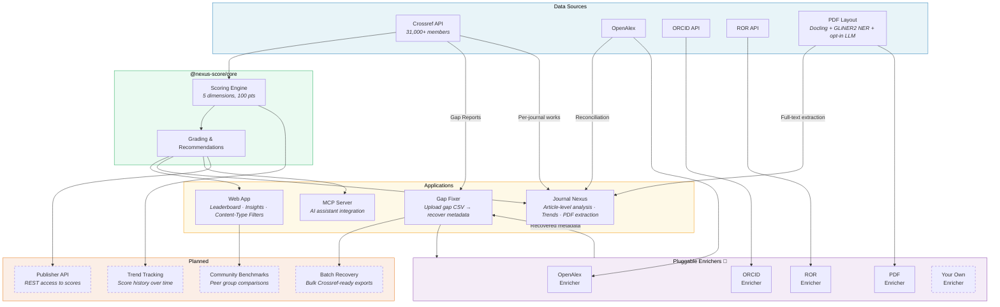

# Research Nexus Score

<p align="center">
  
  <a href="https://doi.org/10.5281/zenodo.19217245"></a>
</p>

<p align="center">
  <strong>Evalúe lo bien que sus metadatos contribuyen a la visión de Research Nexus de Crossref.</strong>
</p>

<p align="center">
  <a href="https://nexus-score.vercel.app">Demo en vivo</a> •
  <a href="#features">Características</a> •
  <a href="#quick-start">Inicio rápido</a> •
  <a href="#scoring-methodology">Metodología</a> •
  <a href="INSIGHTS.md">Perspectivas</a> •
  <a href="#architecture--vision">Arquitectura</a> •
  <a href="#roadmap">Hoja de ruta</a> •
  <a href="#contributing">Contribuciones</a> •
  <a href="#citation">Citación</a>
</p>

---

Research Nexus Score evalúa la cobertura de metadatos en cinco dimensiones — **Procedencia**, **Personas**, **Organizaciones**, **Financiamiento** y **Acceso** — otorgando a las editoriales una puntuación compuesta (0-100) con recomendaciones accionables para mejorarla.

Construido para apoyar la iniciativa [Crossref's Research Nexus](https://www.crossref.org/documentation/research-nexus/) y alineado con la [Declaración de Barcelona sobre Información de Investigación Abierta](https://barcelona-declaration.org/).

## Características

- **Ranking de editoriales**: Clasificaciones para más de 27,830 editoriales basadas en la cobertura de metadatos
- **Puntuación compuesta**: Una única puntuación (0-100) que captura la contribución general de metadatos
- **Desglose por dimensiones**: Identifique fortalezas y debilidades en 5 áreas clave
- **Análisis de tendencias**: Compare prácticas actuales de metadatos frente a históricos (archivo)
- **Recomendaciones accionables**: Sugerencias de mejora con enlaces a la documentación de Crossref
- **Rankings globales**: Vea cómo se posiciona cualquier editorial entre todos los miembros de Crossref
- **Gap Fixer**: Herramienta local y autohospedada que convierte un PDF/DOCX de un artículo en una tarjeta de puntuación de Research Nexus junto con un XML de depósito de DOI listo para Crossref. Licencia AGPL-3.0, sin bloqueo de proveedores, LLM optativo con registro en USD por llamada ([metadata_gapfixer](https://github.com/aadivar/metadata_gapfixer))
- **Journal Nexus**: Análisis profundo a nivel de revista — cobertura de metadatos artículo por artículo, conciliación con OpenAlex, extracción de PDF y seguimiento de tendencias de metadatos
- **Análisis institucional**: Vista a nivel institucional de la calidad de depósito de las editoriales — concilia la producción de una institución (vía OpenAlex) con lo que llegó a Crossref, mostrando brechas de depósito por editorial y editoriales sin mapear
- **Servidor MCP**: Integración con Claude Desktop u otros asistentes de IA
- **Biblioteca Core**: Utilice la lógica de puntuación en sus propias aplicaciones

## Inicio rápido

### Interfaz web

Visite [nexus-score.vercel.app](https://nexus-score.vercel.app) para buscar cualquier miembro de Crossref y ver su puntuación.

### Servidor MCP (para Claude Desktop)

```bash
npx @nexus-score/mcp-server
```

Agregue a su `claude_desktop_config.json`:

```json
{
  "mcpServers": {
    "nexus-score": {
      "command": "npx",
      "args": ["@nexus-score/mcp-server"],
      "env": {
        "CROSSREF_MAILTO": "your-email@example.com"
      }
    }
  }
}
```

### Como biblioteca

```bash
pnpm add @nexus-score/core
```

```typescript
import { CrossrefClient, calculateMemberScore } from '@nexus-score/core';

const client = new CrossrefClient({ mailto: 'your-email@example.com' });
const member = await client.getMember('286'); // Oxford University Press
const score = calculateMemberScore(member);

console.log(score.total);  // 72
console.log(score.grade);  // 'B'
console.log(score.dimensions.provenance.score);  // 18.5
console.log(score.recommendations[0].title);     // 'Aumentar la cobertura de ORCID'
```

## Metodología de puntuación

### Por qué esto importa en la era de la IA

Cada herramienta de investigación con IA — Consensus, Elicit, Semantic Scholar, OpenAlex, ChatGPT y Claude con búsqueda — lee el registro académico a través de metadatos depositados. Un artículo no es "descubrible" en abstracto; es descubrible a través de los campos específicos que una editorial eligió depositar. Los campos faltantes no son brechas decorativas: son el artículo quedándose en silencio en el único lugar donde la IA busca.

Las cinco dimensiones a continuación no son arbitrarias. Cada una se relaciona con algo que un sistema de IA necesita para realizar su trabajo.

La puntuación mide lo que depositan las editoriales, no lo que existe. La mayoría de las brechas son problemas de flujo de trabajo: los datos están aguas arriba — en manuscritos, sistemas de envío, PDFs — pero no llegan al depósito. Esto hace que estas brechas sean **corregibles**, no estructurales. La arquitectura de tres capas (Puntuación → Recomendar → Gap Fixer) se construye alrededor de ese hecho.

**No es un Factor de Impacto.** Nexus Score es independiente del tamaño. Una revista nueva puede obtener una puntuación A desde el primer día. Una editorial universitaria de tres personas puede superar a Elsevier. Lo que deposites es lo que se juzgará — no cuánto publicas, ni qué tan antiguo eres, ni quién te cita.

### Dimensiones (100 puntos en total)

| Dimensión | Puntos | Qué mide | Por qué lo necesita la IA | En palabras simples |
|-----------|--------|------------------|-----------------|------------------|
| **Procedencia** | 25 | Referencias (15), Políticas de actualización (5), Verificación de similitud (5) | Confianza y trazabilidad de la afirmación | ¿De dónde proviene este artículo y podemos confiar en su trayectoria? ¿Nos dijo la editorial cuándo se publicó, qué versión es, bajo qué licencia está y qué cita? Básicamente — ¿está en orden la documentación del artículo? |
| **Personas** | 20 | Cobertura de ORCID iD (20) | Atribución inequívoca de autoría | ¿Sabemos realmente quién lo escribió? ¿Los autores son humanos reales e identificados con ORCID, o solo nombres en una página que podrían pertenecer a cualquiera? Si dos investigadores comparten un nombre, ¿podemos distinguirlos? |
| **Organizaciones** | 15 | Afiliaciones (5), IDs de ROR (10) | Enlaces institucionales legibles por máquina | ¿Sabemos dónde trabajan los autores? ¿La universidad o institución está correctamente identificada con un ID de ROR, o es una cadena de texto libre como "Dept of Bio, Univ" que ninguna máquina puede emparejar con nada? |
| **Financiamiento** | 20 | IDs de Registro de Financiadores (10), Números de beca/convenio (10) | Trazabilidad de la inversión para los financiadores | ¿Quién pagó esta investigación y podemos seguir el dinero? ¿El financiador está identificado con un ID de registro? ¿Está el número de la beca? Sin esto, no puede responder preguntas básicas como "¿qué produjo realmente los $40B del NIH?" |
| **Acceso** | 20 | Licencias (7), Enlaces al texto completo (7), Resúmenes (6) | Si la IA puede leer e ingestar legalmente el trabajo | ¿Puede alguien leerlo realmente? ¿El texto completo es abierto o de pago? ¿Hay una licencia que le diga a las herramientas de IA si tienen permiso para usarlo? Si un artículo existe pero nadie puede acceder a él, para la descubrimiento de IA es como si no existiera. |

### Escala de calificación

| Calificación | Rango de puntuación | Descripción |
|-------|-------------|-------------|
| **A** | 80-100 | Cobertura de metadatos excelente |
| **B** | 65-79 | Buena cobertura con margen de mejora |
| **C** | 50-64 | Cobertura adecuada pero con brechas significativas |
| **D** | 35-49 | Requiere trabajo sustancial en múltiples dimensiones |
| **F** | 0-34 | Cobertura de metadatos deficiente que requiere atención |

### Fuente de datos

Las puntuaciones utilizan estadísticas de cobertura precalculadas de la [API /members de Crossref](https://api.crossref.org/swagger-ui/index.html#/Members). Estas estadísticas se calculan diariamente por Crossref y representan el porcentaje de obras que contienen cada elemento de metadatos.

- **Actual**: Obras publicadas en los últimos 2 años calendario
- **Archivo**: Obras más antiguas en el archivo

## Estructura del proyecto

```
nexus-score/
├── apps/
│   ├── web/                  # Aplicación web Next.js 16
│   │   ├── src/
│   │   │   ├── app/
│   │   │   │   ├── leaderboard/        # Clasificaciones de +27,830 editoriales + filtros
│   │   │   │   ├── member/[id]/        # Tarjeta de puntuación por editorial + radar
│   │   │   │   ├── analysis/
│   │   │   │   │   └── institution/    # Analítica de brechas de depósito institucional (v0.1.1)
│   │   │   │   └── api/                # Búsqueda, miembro, ranking, analizar-institución
│   │   │   └── components/             # Radar, tarjeta de puntuación, tablas de brechas, puntos ciegos
│   │   ├── scripts/          # Scripts de generación de ranking
│   │   └── data/             # Datos en caché del ranking (27,830 editoriales)
│   ├── gap-fixer/            # Herramienta de recuperación de metadatos
│   │   ├── src/
│   │   │   ├── lib/
│   │   │   │   ├── enrichers/  # Clientes de OpenAlex, ORCID, ROR
│   │   │   │   ├── parsers/    # Analizador CSV de informes de brechas
│   │   │   │   └── scoring/    # Puntuación de confianza
│   │   │   └── components/   # Interfaz de carga y análisis
│   │   └── README.md
│   └── journal-nexus/        # Análisis profundo a nivel de revista
│       └── src/
│           ├── app/
│           │   └── api/      # Endpoints de enriquecimiento, tendencias y extracción de PDF
│           └── components/   # Tarjeta de puntuación, tendencias, conciliación, modal de PDF
├── packages/
│   ├── core/                 # Biblioteca de puntuación (@nexus-score/core)
│   │   ├── src/
│   │   │   ├── crossref/     # Cliente de API de Crossref
│   │   │   └── scoring/      # Lógica de cálculo de puntuación
│   │   └── package.json
│   └── mcp-server/           # Servidor MCP (@nexus-score/mcp-server)
│       └── src/
├── package.json              # Configuración del espacio de trabajo raíz
├── turbo.json                # Configuración de Turborepo
└── pnpm-workspace.yaml       # Definición del espacio de trabajo pnpm
```

## Desarrollo

### Requisitos previos

- Node.js 18+
- pnpm 10+

### Configuración

```bash
# Clonar el repositorio
git clone https://github.com/aadivar/nexus-score.git
cd nexus-score

# Instalar dependencias
pnpm install

# Compilar todos los paquetes
pnpm build

# Iniciar servidor de desarrollo
pnpm dev
```

### Variables de entorno

Cree un archivo `.env.local` en `apps/web/`:

```bash
CROSSREF_MAILTO=your-email@example.com
```

Usar su correo electrónico habilita el acceso al grupo "cortés" (polite pool) de Crossref para obtener mejores límites de velocidad.

### Scripts disponibles

| Comando | Descripción |
|---------|-------------|
| `pnpm dev` | Iniciar servidores de desarrollo |
| `pnpm build` | Compilar todos los paquetes y aplicaciones |
| `pnpm lint` | Ejecutar ESLint en todos los paquetes |
| `pnpm test` | Ejecutar pruebas |
| `pnpm mcp` | Iniciar servidor MCP en modo de desarrollo |

### Regeneración del ranking

Los datos del ranking se precálculan a partir de todos los 31,000+ miembros de Crossref:

```bash
cd apps/web
pnpm generate-leaderboard
```

Esto obtiene todos los miembros, calcula las puntuaciones y guarda en `data/leaderboard.json`.

**Actualizaciones automáticas**: Un flujo de trabajo de GitHub Actions se ejecuta quincenalmente (el 1 y 15 de cada mes) para actualizar automáticamente los datos del ranking. También puede activarlo manualmente desde la pestaña Actions.

## ¿Por qué Research Nexus Score?

### El problema

Las editoriales registran metadatos en Crossref, pero no hay una manera fácil de entender:
- ¿Qué tan completos son mis metadatos en comparación con pares?
- ¿Qué áreas necesitan mayor mejora?
- ¿Mejoro o empeoro con el tiempo?

### La solución

Research Nexus Score proporciona:
1. **Visibilidad**: Vea exactamente su posición entre más de 27,830 editoriales
2. **Acción**: Obtenga recomendaciones específicas con enlaces a documentación
3. **Referencia**: Compare con líderes de la industria y pares
4. **Tendencias**: Rastree la mejora con el tiempo (actual vs archivo)

### Alineación con la Declaración de Barcelona

Research Nexus Score respalda la [Declaración de Barcelona sobre Información de Investigación Abierta](https://barcelona-declaration.org/) mediante:

- Hacer visible y comparable la cobertura de metadatos
- Fomentar la adopción de identificadores persistentes (ORCID, ROR)
- Promover la transparencia en los reconocimientos de financiamiento
- Apoyar los principios FAIR para metadatos

## Journal Nexus

Journal Nexus va más allá del ranking: analiza una revista artículo por artículo para mostrar exactamente dónde están las brechas de metadatos, qué es recuperable y cómo evoluciona la calidad con el tiempo.

### Cómo funciona

1. **Buscar** cualquier revista por ISSN o título
2. **Puntuación** — vea la puntuación Nexus de la revista con desglose por dimensiones y recomendaciones
3. **Tendencias** — cobertura de metadatos por mes, desglosada por tipo de contenido, con perspectivas automatizadas
4. **Análisis de artículos** — cada artículo verificado contra Crossref, luego conciliado con OpenAlex para mostrar lo que falta frente a lo que es recuperable
5. **Extracción de PDF** — para artículos con las brechas más grandes, extrae metadatos directamente del PDF (autores, ORCID, afiliaciones, financiamiento, referencias)
6. **Resumen de impacto** — informe exportable que muestra el potencial de recuperación y proyecciones de puntuación antes/después

### Hallazgo clave

La mayoría de las brechas de metadatos son **problemas de flujo de trabajo, no de contenido**. Los datos existen aguas arriba — en sistemas de envío, en OpenAlex, en los propios PDFs — simplemente no llegan al depósito de Crossref. Journal Nexus hace esto visible a nivel de artículo.

## Gap Fixer

Una vez que sabe qué metadatos faltan, Gap Fixer le ayuda a recuperarlos: un artículo a la vez, con cada llamada pagada de LLM medida en USD y protegida por un clic explícito del editor.

> **El piloto está abierto.** Autohospedado, AGPL-3.0, sin bloqueo de proveedores. **$1/artículo — solo precio de sostén**, para mantener el proyecto vivo. El software es y permanece gratuito bajo AGPL; puede autohospedar toda la canalización a costo cero por artículo para siempre. Envíe un correo a <aadi@nexus-score.org> para agendar una demostración o postularse.

La herramienta reside en su propio repositorio: **<https://github.com/aadivar/metadata_gapfixer>**.

### Cómo funciona

Suba un solo PDF/DOCX de un artículo de revista. La canalización produce una tarjeta de puntuación de Research Nexus (usando los mismos pesos que este proyecto) junto con un XML de depósito de DOI listo para Crossref.

Cinco capas, cada una sobre la anterior. Los costos son transparentes y el LLM nunca se llama automáticamente:

| Capa | Qué | Costo | Disparador |
|---|---|---|---|
| **L0 · Diseño Docling** | PDF/DOCX → JSON estructurado, bboxes por elemento, renderizado de páginas | $0 | Siempre |
| **L1 · Ficha determinista** | Barrido regex (DOI / ORCID / ROR / ISSN / arXiv / licencia / beca) + PDF /Info + analizador de encabezados + anclajes estándar (financiamiento, CoI, disponibilidad de datos, ética) | $0 | Siempre |
| **L2 · APIs gratuitas de identificadores** | ORCID público · ROR v2 · OpenAlex · Crossref REST. Normalización de afiliaciones + aceptación automática de ganador claro en ROR | $0 | Clic en corrección automática |
| **L3 · Selector LLM** | Llamada de salida estructurada por campo que elige entre candidatos devueltos por la API con razonamiento + confianza | ~$0.0002/llamada | Por campo "Adjudicar con IA" |
| **L4 · Estructurador LLM** | Cinco tareas nombradas (`structure_authors`, `structure_references`, `structure_funding`, `structure_credit`, `verify_authors`) que toman una región de contenido y devuelven un registro estructurado limpio | ~$0.0003 – $0.013/llamada | Por campo "Identificar en documento" |
| **Lateral · GLiNER2 NER** | NER zero-shot en dispositivo (`fastino/gliner2-large-v1`) para extracción de entidades ad-hoc sobre una región de texto elegida — sin red, sin costo de LLM | $0 | Bajo demanda |

Para un artículo típico, el procesamiento premium completo ronda los **$0.025**. La corrección automática estándar (sin LLM) es **$0**. Cada llamada pagada se registra en un libro mayor en USD por envío.

### Campos recuperables

| Campo | Fuentes |
|---|---|
| Autores (nombres completos) | Analizador de encabezados L1, `structure_authors` L4 |
| IDs de ORCID | Regex L1, API ORCID L2 + respaldo de intercambio de nombre, selector L3 |
| Afiliaciones | Mapa de marcadores de encabezado L1, ORCID/OpenAlex L2, estructurador L4 |
| IDs de ROR | ROR v2 L2 con normalización de eliminación de comas + aceptación automática de ganador claro |
| IDs de Registro de Financiadores | Patrones de beca L1, OpenAlex/Crossref L2, `structure_funding` L4 |
| Números de beca/convenio | Regex L1, `structure_funding` L4 |
| Referencias | L1 + detector de sección de referencias de tres niveles, OpenAlex/Crossref L2, `structure_references` L4 |
| Resúmenes | Docling L0, OpenAlex L2 |
| Licencias | Patrones de licencia L1, OpenAlex/Crossref L2 |
| Roles de contribuidor CRediT | `structure_credit` L4 |

**Sin fabricación.** El LLM está limitado por salidas estructuradas y listas explícitas de candidatos. Los ORCID, DOI, ROR e ISSN provienen de APIs o texto de PDF: nunca se inventan. El estructurador `verify_authors` también recibe el título del artículo, un fragmento del resumen y los conceptos de OpenAlex para poder rechazar candidatos cuyo dominio de investigación no coincida.

### Autoalojamiento

```bash
git clone https://github.com/aadivar/metadata_gapfixer
cd metadata_gapfixer
cp .env.example .env                # editar OPENAI_API_KEY + CONTACT_EMAIL
docker compose up -d --build
```

Abra <http://localhost:3000>. El enrutador de LLM es compatible con OpenAI: apúntelo a OpenAI, OpenRouter, Anthropic-compat, Groq, Ollama o LiteLLM. El almacenamiento es en disco simple; cambie a S3/Postgres sin tocar el código de la aplicación. Consulte el [README de metadata_gapfixer](https://github.com/aadivar/metadata_gapfixer#readme) para la documentación completa.

## Arquitectura y visión



> **Cajas sólidas** = implementadas. **Cajas punteadas** = planificadas. La capa de enriquecedores plug-in (púrpura) es el punto clave de extensibilidad: cualquiera puede agregar su propia fuente de metadatos.

## Hoja de ruta

| Fase | Qué | Estado |
|-------|------|--------|
| **Puntuación** | Ranking de editoriales con +27,830 miembros, puntuación compuesta, calificación | Hecho |
| **Gap Fixer** | Recuperar metadatos faltantes de OpenAlex, ORCID, ROR y extracción de PDF | Hecho |
| **Journal Nexus** | Análisis de artículos a nivel de revista — cobertura de metadatos artículo por artículo, conciliación con OpenAlex, tendencias de metadatos y extracción de texto completo de PDF | En progreso — evaluando con editoriales |
| **Filtrado por tipo de contenido** | Filtrar ranking y perspectivas por tipo de contenido (artículo de revista, capítulo de libro, etc.) | Hecho |
| **Enriquecedores plug-in** | Recuperación modular de metadatos — Docling, ficha determinista, OpenAlex, ORCID, ROR, Crossref, GLiNER2 NER en dispositivo y un enrutador LLM compatible con OpenAI. Lanzado como [metadata_gapfixer](https://github.com/aadivar/metadata_gapfixer) | Hecho |
| **Vista institucional** | Conciliar la producción de una institución (vía OpenAlex) con lo que llegó a Crossref — mostrar brechas de depósito por editorial y editoriales sin mapear | En progreso — evaluando con institutos |
| **API para editoriales** | API REST para acceso programático a puntuaciones e informes de brechas | Planificado |
| **Recuperación por lotes** | Recuperación masiva de metadatos con archivos de exportación listos para Crossref | Planificado |
| **Seguimiento de tendencias** | Seguimiento histórico de puntuaciones — vea la mejora con el tiempo por editorial | Planificado |
| **Referencias comunitarias** | Comparaciones por grupo de pares por tamaño, disciplina y región | Planificado |

### Arquitectura plug-in

Gap Fixer recupera metadatos faltantes (ORCID, financiadores, afiliaciones, resúmenes, referencias) extrayendo de múltiples fuentes — OpenAlex, ORCID, ROR y extracción de PDF. Cada fuente es un módulo enriquecedor independiente. Editoriales y proveedores de infraestructura pueden conectar sus propias fuentes o intercambiar backends de extracción para adaptarse a su flujo de trabajo: sin bloqueo a ningún proveedor.

**Enriquecedores integrados:**
- [Docling](https://github.com/docling-project/docling) — extracción local de diseño PDF/DOCX (JSON estructurado, bboxes, renderizado de páginas) a $0
- Ficha determinista — barrido regex para patrones de DOI / ORCID / ROR / ISSN / arXiv / licencia / beca + anclajes estándar
- [OpenAlex](https://openalex.org/) — ORCID, IDs de ROR, afiliaciones, referencias, resúmenes, financiadores
- [API pública de ORCID](https://info.orcid.org/documentation/api-tutorials/) — validación de identidad de autor con respaldo de intercambio de nombre
- [ROR v2](https://ror.org/about/) — emparejamiento de identificadores de organización con aceptación automática de ganador claro
- [Crossref REST](https://api.crossref.org/) — diferencia de registro existente para actualizaciones seguras
- [GLiNER2](https://huggingface.co/fastino/gliner2-large-v1) — NER zero-shot en dispositivo para extracción de entidades ad-hoc (sin red, sin costo de LLM)
- Enrutador LLM compatible con OpenAI (optativo, registro en USD por llamada) — funciona con OpenAI, OpenRouter, Anthropic-compat, Groq, Ollama, LiteLLM

**En seguimiento:**
- Respaldo GROBID para PDF solo OCR / escaneados
- Instantánea diaria local de ROR / ORCID para editoriales aisladas (air-gapped)
- Validación XSD contra esquema 5.4.0 de Crossref + integración directa con API de depósito

El objetivo: las brechas de metadatos son un problema de flujo de trabajo, no un problema disciplinario. Con enriquecedores plug-in, cualquiera puede recuperar lo que falta utilizando las fuentes que mejor funcionen para ellos. Todo es código abierto y con licencia AGPL-3.0: se aceptan contribuciones y patrocinadores.

¿Tiene ideas? [Abra un issue](https://github.com/aadivar/nexus-score/issues) o únase a la conversación en [LinkedIn](https://www.linkedin.com/feed/update/urn:li:activity:7441758924527222784/).

## Stack tecnológico

- **Framework**: [Next.js 16](https://nextjs.org/) con App Router
- **Estilos**: [Tailwind CSS](https://tailwindcss.com/)
- **Monorepo**: [Turborepo](https://turbo.build/) + [pnpm](https://pnpm.io/)
- **Lenguaje**: [TypeScript](https://www.typescriptlang.org/)
- **MCP**: [SDK de Protocolo de Contexto de Modelo](https://modelcontextprotocol.io/)
- **Datos**: [API REST de Crossref](https://api.crossref.org/)

## Contribuciones

¡Aceptamos contribuciones! Consulte nuestra [Guía de contribuciones](CONTRIBUTING.md) para más detalles.

### Ideas rápidas de contribución

- Agregar nuevas dimensiones o métricas de puntuación
- Mejorar la UI/UX de la aplicación web
- Agregar más herramientas MCP para integraciones de IA
- Escribir documentación o tutoriales
- Informar errores o sugerir funciones

## Licencia

- **Código fuente** — [AGPL-3.0](LICENSE).
- **Datos derivados y puntuaciones** — [CC BY-NC 4.0](LICENSE-DATA). Gratuito para uso no comercial con atribución.
- **Uso comercial** — requiere una licencia separada. Consulte [COMMERCIAL-USE.md](COMMERCIAL-USE.md).
- **Metadatos upstream de Crossref** — Términos propios de Crossref (CC0).
- **Uso de marca** — nombres y logotipos están regidos por separado por [TRADEMARKS.md](TRADEMARKS.md).
- **Avisos de derechos de autor y conjuntos de datos** — consulte [NOTICE](NOTICE) y [DATA-NOTICE.md](DATA-NOTICE.md).

## Agradecimientos

- [Crossref](https://www.crossref.org/) por la API REST y los estándares de metadatos
- [Protocolo de Contexto de Modelo](https://modelcontextprotocol.io/) por el SDK de MCP
- La comunidad de comunicación académica por los comentarios y la inspiración

## Citación

Si utiliza o menciona Research Nexus Score en su trabajo, cítelo como:

```bibtex
@software{nexus_score,
  author       = {Varma D., Aadinarayana},
  title        = {Research Nexus Score: Metadata Coverage Scoring for Crossref Members},
  year         = {2025},
  doi          = {10.5281/zenodo.19217245},
  url          = {https://doi.org/10.5281/zenodo.19217245},
  note         = {Herramienta de código abierto para evaluar la calidad de metadatos de editoriales}
}
```

O en texto:

> Varma D., A. (2025). *Research Nexus Score: Metadata Coverage Scoring for Crossref Members*. https://doi.org/10.5281/zenodo.19217245

## Autor

**Aadi Narayana Varma**

- LinkedIn: [@aadi-narayana-varma-dantuluri](https://www.linkedin.com/in/aadi-narayana-varma-dantuluri-62332b105/)
- GitHub: [@aadivar](https://github.com/aadivar)
- Email: aadi@nexus-score.org

---

<p align="center">
  <sub>Construido con cuidado para la comunidad de investigación abierta</sub>
</p>
