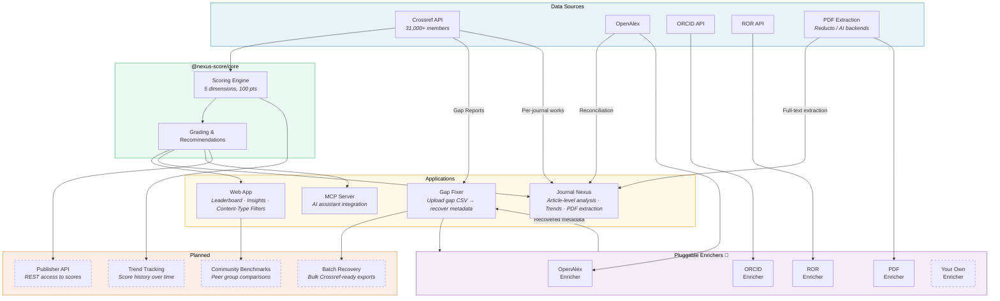

# Research Nexus Score

<p align="center">
  
  <a href="https://doi.org/10.5281/zenodo.19217245"></a>
</p>

<p align="center">
  <strong>Measure how well your metadata contributes to Crossref's Research Nexus vision.</strong>
</p>

<p align="center">
  <a href="https://nexus-score.vercel.app">Live Demo</a> •
  <a href="#features">Features</a> •
  <a href="#quick-start">Quick Start</a> •
  <a href="#scoring-methodology">Methodology</a> •
  <a href="INSIGHTS.md">Insights</a> •
  <a href="#architecture--vision">Architecture</a> •
  <a href="#roadmap">Roadmap</a> •
  <a href="#contributing">Contributing</a> •
  <a href="#citation">Citation</a>
</p>

---

Research Nexus Score evaluates metadata coverage across five dimensions — **Provenance**, **People**, **Organizations**, **Funding**, and **Access** — giving publishers a composite score (0-100) with actionable recommendations for improvement.

Built to support [Crossref's Research Nexus](https://www.crossref.org/documentation/research-nexus/) initiative and aligned with the [Barcelona Declaration on Open Research Information](https://barcelona-declaration.org/).

## Features

- **Publisher Leaderboard**: Rankings for 27,830+ publishers based on metadata coverage
- **Composite Scoring**: Single score (0-100) that captures overall metadata contribution
- **Dimension Breakdown**: Identify strengths and weaknesses across 5 key areas
- **Trend Analysis**: Compare current metadata practices vs historical (backfile)
- **Actionable Recommendations**: Improvement suggestions with links to Crossref documentation
- **Global Rankings**: See where any publisher stands among all Crossref members
- **Gap Fixer**: Recover missing metadata from Crossref Participation Reports using open data sources
- **Journal Nexus**: Journal-level deep analysis — article-by-article metadata coverage, OpenAlex reconciliation, PDF extraction, and metadata trend tracking
- **MCP Server**: Integrate with Claude Desktop or other AI assistants
- **Core Library**: Use scoring logic in your own applications

## Quick Start

### Web Interface

Visit [nexus-score.vercel.app](https://nexus-score.vercel.app) to search for any Crossref member and view their score.

### MCP Server (for Claude Desktop)

```bash
npx @nexus-score/mcp-server
```

Add to your `claude_desktop_config.json`:

```json
{
  "mcpServers": {
    "nexus-score": {
      "command": "npx",
      "args": ["@nexus-score/mcp-server"],
      "env": {
        "CROSSREF_MAILTO": "your-email@example.com"
      }
    }
  }
}
```

### As a Library

```bash
pnpm add @nexus-score/core
```

```typescript
import { CrossrefClient, calculateMemberScore } from '@nexus-score/core';

const client = new CrossrefClient({ mailto: 'your-email@example.com' });
const member = await client.getMember('286'); // Oxford University Press
const score = calculateMemberScore(member);

console.log(score.total);  // 72
console.log(score.grade);  // 'B'
console.log(score.dimensions.provenance.score);  // 18.5
console.log(score.recommendations[0].title);     // 'Increase ORCID Coverage'
```

## Scoring Methodology

### Why this matters in the AI era

Every AI research tool — Consensus, Elicit, Semantic Scholar, OpenAlex, ChatGPT and Claude with search — reads the scholarly record through deposited metadata. A paper isn't "discoverable" in the abstract; it's discoverable through the specific fields a publisher chose to deposit. Missing fields aren't decoration gaps — they're the paper going silent in the one place AI looks.

The five dimensions below aren't arbitrary. Each maps to something an AI system needs to do its job.

The score measures what publishers deposit, not what exists. Most gaps are pipeline problems: the data is upstream — in manuscripts, submission systems, PDFs — but doesn't make it into the deposit. That makes these gaps **fixable**, not structural. The three-layer architecture (Score → Recommend → Gap Fixer) is built around that fact.

**Not an Impact Factor.** Nexus Score is size-independent. A new journal can score A on day one. A three-person university press can outscore Elsevier. What you deposit is what you're judged on — not how much you publish, not how old you are, not who cites you.

### Dimensions (100 points total)

| Dimension | Points | What It Measures | Why AI needs it | In plain English |
|-----------|--------|------------------|-----------------|------------------|
| **Provenance** | 25 | References (15), Update Policies (5), Similarity Check (5) | Trust and traceability of the claim | Where did this paper come from, and can we trust the trail? Did the publisher tell us when it was published, what version this is, what license it's under, and what it cites? Basically — is the paper's paperwork in order. |
| **People** | 20 | ORCID iD Coverage (20) | Unambiguous author attribution | Do we actually know who wrote it? Are the authors real, identified humans with ORCIDs — or just names on a page that could belong to anyone? If two researchers share a name, can we tell them apart? |
| **Organizations** | 15 | Affiliations (5), ROR IDs (10) | Machine-readable institutional links | Do we know where the authors work? Is the university or institution properly identified with a ROR ID, or is it a free-text string like "Dept of Bio, Univ" that no machine can match to anything? |
| **Funding** | 20 | Funder Registry IDs (10), Award Numbers (10) | Investment traceability for funders | Who paid for this research, and can we follow the money? Is the funder identified with a registry ID? Is the grant number there? Without this, you can't answer basic questions like "what did the NIH's $40B actually produce?" |
| **Access** | 20 | Licenses (7), Full-text Links (7), Abstracts (6) | Whether AI can legally read and ingest the work | Can anyone actually read it? Is the full text open, or paywalled? Is there a license that tells AI tools whether they're allowed to use it? If a paper exists but no one can access it, it may as well not exist for AI discovery. |

### Grading Scale

| Grade | Score Range | Description |
|-------|-------------|-------------|
| **A** | 80-100 | Excellent metadata coverage |
| **B** | 65-79 | Good coverage with room for improvement |
| **C** | 50-64 | Adequate coverage but with significant gaps |
| **D** | 35-49 | Needs substantial work across multiple dimensions |
| **F** | 0-34 | Poor metadata coverage requiring attention |

### Data Source

Scores use pre-computed coverage statistics from the [Crossref /members API](https://api.crossref.org/swagger-ui/index.html#/Members). These statistics are calculated daily by Crossref and represent the percentage of works containing each metadata element.

- **Current**: Works published in the last 2 calendar years
- **Backfile**: Older works in the archive

## Project Structure

```
nexus-score/
├── apps/
│   ├── web/                  # Next.js 16 web application
│   │   ├── src/
│   │   │   ├── app/          # App router pages
│   │   │   └── components/   # React components
│   │   ├── scripts/          # Leaderboard generation scripts
│   │   └── data/             # Cached leaderboard data (27,830 publishers)
│   ├── gap-fixer/            # Metadata recovery tool
│   │   ├── src/
│   │   │   ├── lib/
│   │   │   │   ├── enrichers/  # OpenAlex, ORCID, ROR clients
│   │   │   │   ├── parsers/    # Gap report CSV parser
│   │   │   │   └── scoring/    # Confidence scoring
│   │   │   └── components/   # Upload & analysis UI
│   │   └── README.md
│   └── journal-nexus/        # Journal-level deep analysis
│       └── src/
│           ├── app/
│           │   └── api/      # Enrich, trends, PDF extraction endpoints
│           └── components/   # Score card, trends, reconciliation, PDF modal
├── packages/
│   ├── core/                 # Scoring library (@nexus-score/core)
│   │   ├── src/
│   │   │   ├── crossref/     # Crossref API client
│   │   │   └── scoring/      # Score calculation logic
│   │   └── package.json
│   └── mcp-server/           # MCP server (@nexus-score/mcp-server)
│       └── src/
├── package.json              # Root workspace config
├── turbo.json                # Turborepo configuration
└── pnpm-workspace.yaml       # pnpm workspace definition
```

## Development

### Prerequisites

- Node.js 18+
- pnpm 10+

### Setup

```bash
# Clone the repository
git clone https://github.com/aadivar/nexus-score.git
cd nexus-score

# Install dependencies
pnpm install

# Build all packages
pnpm build

# Start development server
pnpm dev
```

### Environment Variables

Create a `.env.local` file in `apps/web/`:

```bash
CROSSREF_MAILTO=your-email@example.com
```

Using your email enables access to Crossref's polite pool for better rate limits.

### Available Scripts

| Command | Description |
|---------|-------------|
| `pnpm dev` | Start development servers |
| `pnpm build` | Build all packages and apps |
| `pnpm lint` | Run ESLint across all packages |
| `pnpm test` | Run tests |
| `pnpm mcp` | Start MCP server in development mode |

### Regenerating the Leaderboard

The leaderboard data is pre-computed from all 31,000+ Crossref members:

```bash
cd apps/web
pnpm generate-leaderboard
```

This fetches all members, calculates scores, and saves to `data/leaderboard.json`.

**Automated Updates**: A GitHub Actions workflow runs biweekly (1st and 15th of each month) to automatically update the leaderboard data. You can also trigger it manually from the Actions tab.

## Why Research Nexus Score?

### The Problem

Publishers register metadata with Crossref, but there's no easy way to understand:
- How complete is my metadata compared to peers?
- Which areas need the most improvement?
- Am I getting better or worse over time?

### The Solution

Research Nexus Score provides:
1. **Visibility**: See exactly where you stand among 27,830+ publishers
2. **Actionability**: Get specific recommendations with documentation links
3. **Benchmarking**: Compare against industry leaders and peers
4. **Trends**: Track improvement over time (current vs backfile)

### Barcelona Declaration Alignment

Research Nexus Score supports the [Barcelona Declaration on Open Research Information](https://barcelona-declaration.org/) by:

- Making metadata coverage visible and comparable
- Encouraging adoption of persistent identifiers (ORCID, ROR)
- Promoting transparency in funding acknowledgements
- Supporting FAIR principles for metadata

## Journal Nexus

Journal Nexus goes deeper than the leaderboard — it analyzes a journal article-by-article to show exactly where metadata gaps are, what's recoverable, and how quality trends over time.

### How It Works

1. **Search** for any journal by ISSN or title
2. **Score** — see the journal's Nexus Score with dimension breakdown and recommendations
3. **Trends** — metadata coverage by month, broken down by content type, with automated insights
4. **Article Analysis** — every article checked against Crossref, then reconciled with OpenAlex to show what's missing vs what's recoverable
5. **PDF Extraction** — for articles with the biggest gaps, extract metadata directly from the PDF (authors, ORCIDs, affiliations, funding, references)
6. **Impact Summary** — exportable report showing recovery potential and before/after score projections

### Key Finding

Most metadata gaps are **pipeline problems, not content problems**. The data exists upstream — in submission systems, in OpenAlex, in the PDFs themselves — it just doesn't make it into the Crossref deposit. Journal Nexus makes that visible at the article level.

## Gap Fixer

Once you know what metadata is missing, Gap Fixer helps you recover it.

### How It Works

1. **Upload** your [Crossref Participation Report](https://www.crossref.org/documentation/reports/participation-reports/) gap CSV
2. **Enrich** each DOI using OpenAlex, ORCID, ROR APIs + Reducto PDF extraction
3. **Score** recovered data with multi-source confidence levels
4. **Export** high-confidence recoveries formatted for Crossref submission

### Supported Recovery

| Gap Type | Sources | Confidence |
|----------|---------|------------|
| Abstracts | OpenAlex, Reducto | Up to 95% |
| References | OpenAlex, Reducto | Up to 95% |
| ORCID iDs | OpenAlex, ORCID, Reducto | Up to 100% |
| Affiliations | OpenAlex, Reducto | Up to 95% |
| ROR IDs | OpenAlex, ROR | Up to 95% |
| Funder IDs | OpenAlex, Reducto | Up to 95% |
| Award Numbers | OpenAlex, Reducto | Up to 95% |
| Licenses | OpenAlex, Reducto | Up to 95% |

See [apps/gap-fixer/README.md](apps/gap-fixer/README.md) for detailed documentation.

## Architecture & Vision



> **Solid boxes** = shipped. **Dashed boxes** = planned. The pluggable enricher layer (purple) is the key extensibility point — anyone can add their own metadata source.

## Roadmap

| Phase | What | Status |
|-------|------|--------|
| **Scoring** | Publisher leaderboard with 27,830+ members, composite scoring, grading | Done |
| **Gap Fixer** | Recover missing metadata from OpenAlex, ORCID, ROR, and PDF extraction | Done |
| **Journal Nexus** | Journal-level article analysis — article-by-article metadata coverage, OpenAlex reconciliation, metadata trends, and PDF full-text extraction | In progress — evaluating with publishers |
| **Content-Type Filtering** | Filter leaderboard and insights by content type (journal-article, book-chapter, etc.) | Done |
| **Pluggable Enrichers** | Modular metadata recovery — plug in any source (OpenAlex, ORCID, ROR, PDF extraction, or your own) to fill gaps your way | In progress |
| **Publisher API** | REST API for programmatic access to scores and gap reports | Planned |
| **Batch Recovery** | Bulk metadata recovery with Crossref-ready export files | Planned |
| **Trend Tracking** | Historical score tracking — see improvement over time per publisher | Planned |
| **Community Benchmarks** | Peer group comparisons by size, discipline, and region | Planned |

### Pluggable Architecture

Gap Fixer recovers missing metadata (ORCIDs, funders, affiliations, abstracts, references) by pulling from multiple sources — OpenAlex, ORCID, ROR, and PDF extraction. Each source is an independent enricher module. Publishers and infrastructure providers can plug in their own sources or swap extraction backends to fit their workflow — no lock-in to any single provider.

**Built-in enrichers:**
- [OpenAlex](https://openalex.org/) — ORCIDs, ROR IDs, affiliations, references, abstracts, funders
- [Reducto](https://reducto.ai/) — AI-powered structured extraction from scholarly PDFs (abstracts, authors, affiliations, funding, references)

**In progress:**
- [ORCID API](https://info.orcid.org/documentation/api-tutorials/) — Author identity validation (enricher built, integration in progress)
- [ROR API](https://ror.org/about/) — Organization identifier matching (enricher built, integration in progress)

**On the radar:**
- DeepSeek, Google Gemini, AWS Textract, Azure Document Intelligence, Mistral, LlamaParse

The goal: metadata gaps are a pipeline problem, not a discipline problem. With pluggable enrichers, anyone can recover what's missing using the sources that work best for them. Everything is open source and AGPL-3.0-licensed — contributions and sponsors welcome.

Have ideas? [Open an issue](https://github.com/aadivar/nexus-score/issues) or jump into the conversation on [LinkedIn](https://www.linkedin.com/feed/update/urn:li:activity:7441758924527222784/).

## Tech Stack

- **Framework**: [Next.js 16](https://nextjs.org/) with App Router
- **Styling**: [Tailwind CSS](https://tailwindcss.com/)
- **Monorepo**: [Turborepo](https://turbo.build/) + [pnpm](https://pnpm.io/)
- **Language**: [TypeScript](https://www.typescriptlang.org/)
- **MCP**: [Model Context Protocol SDK](https://modelcontextprotocol.io/)
- **Data**: [Crossref REST API](https://api.crossref.org/)

## Contributing

We welcome contributions! Please see our [Contributing Guide](CONTRIBUTING.md) for details.

### Quick Contribution Ideas

- Add new scoring dimensions or metrics
- Improve the UI/UX of the web application
- Add more MCP tools for AI integrations
- Write documentation or tutorials
- Report bugs or suggest features

## License

This project is licensed under the AGPL-3.0 License - see the [LICENSE](LICENSE) file for details.

## Acknowledgments

- [Crossref](https://www.crossref.org/) for the REST API and metadata standards
- [Model Context Protocol](https://modelcontextprotocol.io/) for the MCP SDK
- The scholarly communication community for feedback and inspiration

## Citation

If you use or mention Research Nexus Score in your work, please cite it as:

```bibtex
@software{nexus_score,
  author       = {Varma D., Aadinarayana},
  title        = {Research Nexus Score: Metadata Coverage Scoring for Crossref Members},
  year         = {2025},
  doi          = {10.5281/zenodo.19217245},
  url          = {https://doi.org/10.5281/zenodo.19217245},
  note         = {Open-source tool for evaluating publisher metadata quality}
}
```

Or in text:

> Varma D., A. (2025). *Research Nexus Score: Metadata Coverage Scoring for Crossref Members*. https://doi.org/10.5281/zenodo.19217245

## Author

**Aadi Narayana Varma**

- LinkedIn: [@aadi-narayana-varma-dantuluri](https://www.linkedin.com/in/aadi-narayana-varma-dantuluri-62332b105/)
- GitHub: [@aadivar](https://github.com/aadivar)
- Email: varma2friend@gmail.com

---

<p align="center">
  <sub>Built with care for the open research community</sub>
</p>
